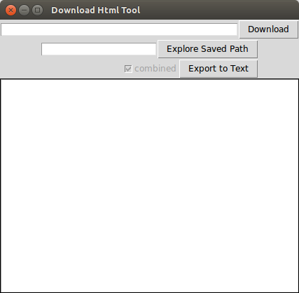

# 秘源宝箱

**包含众多小工具的宝箱，借用秘源之力解放自我  🎉🎉🎉**

---

使用 Java（要求 JDK 21, 推荐使用 `GraalVM`）, Python 等语言实现

* `./mytool.sh` 查看程序信息，`--help={COMMAND}` 查看具体命令的帮助信息, 如 `--help=converts`
* `--debug=true` 打开调试模式
* `--jar` 启动 Java 版本，默认为原生编译版本，如 `mytool.sh --jar --tool=converts`

部分命令支持别名， 如 `--tool=converts --cmd=random --in=test` 的别名为 `--random=test`，具体可查看帮助文档，也可借助命令助手配置别名

项目构建:

* `mvn package` 构建 jar 包
* `mvn package -Pnative` 构建本地代码

**TODO**

* [ ] Web 页面，接口基本完成，暂缺前端页面
* [ ] JavaFX

⚠️ 原生版本目前只提供 Linux 版，其它平台需执行 `./mytool.sh --jar` 运行 jar 版，也可修改脚本默认启动 jar 版或下载源码构建

## 命令助手

使用前需要把 `source ～/.mytool/alias` 添加到 shell 配置中

* 命令管理，方便管理日常使用的长命令，如查询，添加标签等
* 别名管理，可针对长命令配置别名，并导出到当前环境

使用:

* 添加 `./mytool.sh --tool=cHelper --add="@helper mytool --tool=cHelper #mytool #my"`，`@`开头的为别名，可选参数；`#`开头的为标签，可以为多个，可选参数
* 导出到环境变量 `./mytool.sh --tool=cHelper --store=ALL` ，`--store` 参数可指定需要导出的命令，支持别名和标签，如 `--store="#kafka"`
* 查询 `./mytool.sh --tool=cHelper --find=ALL` 查询命令，支持别名和标签，可以多个，如 `--find="#my @helper"`

内置别名：

```
@helper mytool --tool=cHelper #mytool
@mlower mytool --tool=converts --cmd=lower #mytool
@mupper mytool --tool=converts --cmd=upper #mytool
@mmd5 mytool --tool=converts --cmd=md5 #mytool
@mtimesp mytool --tool=converts --cmd=timesp #mytool
@mnow mytool --tool=converts --cmd=now #mytool
@mhdate mytool --tool=converts --cmd=hdate #mytool
```

## 常用字符串转换工具

使用: `./mytool.sh --tool=converts --cmd="now" --pipeline="md5 | base64"`

支持功能（可通过 `|` 连接多个命令）:

* md5，生成指定字符串的 md5 值
* kindle，Kindle 笔记内容转换为 Markdown 文档
* upper/lower，字符串大小写转换
* hdate，时间戳转换为易于阅读的时间格式
* timesp，把时间转换为时间戳
* now，当前时间戳
* replace，字符串替换
* base64, 编码和解码
* ...

## 网页下载

* 链接递归遍历
* 代理
* 批量下载
* 转换为 Markdown

使用: `./mytool.sh --tool=htmlDown --url="https://example.com"`

## Git 提交记录生成更新日志

使用: `./mytool.sh --tool=gitCommits2Log --path=./`

## 简单 Web 文件服务器

使用 `./mytool.sh --tool=dirWebServer`

## JSON 生成对象

使用: `./mytool.sh --tool=json2POJO --path=./`

支持:

* Java class/record

## Trello 导出的 JSON 文件导入到 Logseq

支持把从 Trello 看板导出的 JSON 文件导入到 Logseq

##  文件重命名

使用: `./mytool.sh --tool=rename --path=./`

支持:

* order, 文件序号
* date, 日期
* datetime, 时间
* urlencoded, 解码 URL 编码
* replace, 字符串替换

## 阅读软件笔记、高亮导出为 markdown 文件

支持 Kindle、Moon+ Reader

## dhtml2text

该脚本可以下载指定页面下的所有a标签对应的链接，也可把下载下来的html页面合并为纯文本文件。



脚本使用Python3, 网页转文本使用`html2text`完成。

使用:


### 安装依赖

```
pip3 install html2text
pip3 install chardet
```

### 运行

```
python3 dhtml2text.py
```

## LinkCovertTool

Java，可把后缀为`.desktop`，`.webloc`的多个网页快捷文件提取到链接并输出到Markdown文件。

## 简单笔记

简单笔记软件，开发目的是为局域网内部的多台设备进行信息同步，基于 Vert.x Web 开发，内容以 JSON 格式存储到文件中

配置:

* filepath，文件保存路径，默认为当前目录
* filename，文件名称，默认为 `note.json`
* port，监听端口，默认为 `38080`

## JSON 格式化

使用: `./mytool.sh --tool=json [--json='{}'] [--path=dmeo.json]`

# 致谢

