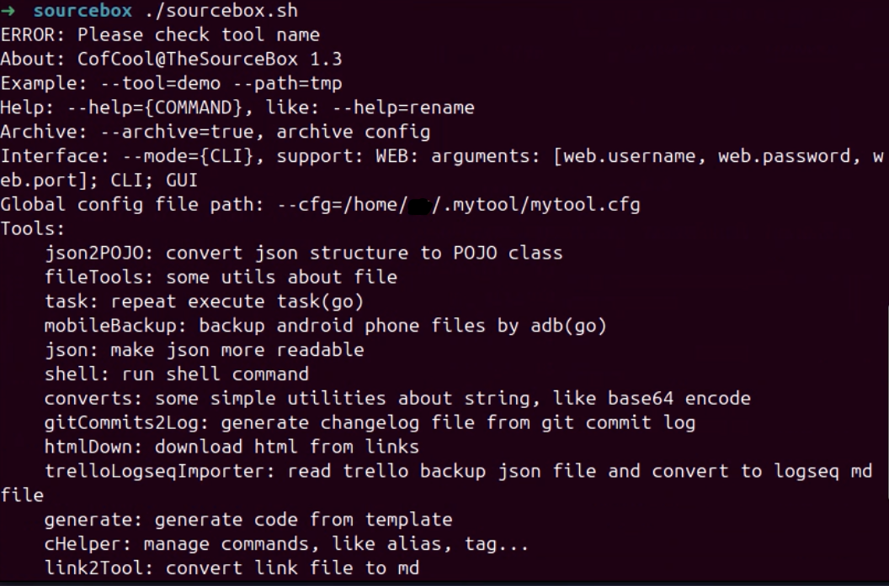
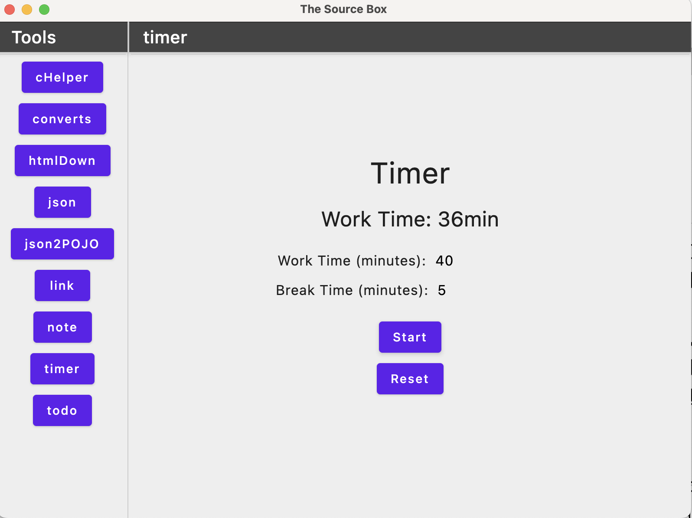
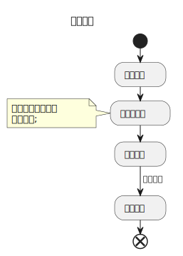

# 秘源宝箱

**包含众多小工具的宝箱，借用秘源之力解放自我  🎉🎉🎉**

---

使用 Java（要求 JDK 21）、Python、Go 等语言实现，桌面版使用 KMP 实现，基于 Vert.x 实现，各个客户端通过调用本地启动的后台服务来实现功能，默认端口为 38080

命令参数也可通过全局配置文件进行配置，路径为 `~/.mytool/mytool.cfg`

* `./sourcebox.sh` 查看程序信息，`--help={COMMAND}` 查看具体命令的帮助信息, 如 `--help=converts`
* `--debug=true` 打开调试模式

部分命令支持别名， 如 `--tool=converts --cmd=md5 --in=test` 的别名为 `--md5=test`，具体可查看帮助文档，也可借助命令助手配置别名

项目构建:

* `mvn package` 构建 jar 包，同时构建 Go 版实现

**TODO**

* [ ] Web

软件截图

命令模式:



图形界面模式:



## 命令助手

使用前需要把 `source ～/.sourcebox/alias` 添加到 shell 配置中

* 命令管理，方便管理日常使用的长命令，如查询，添加标签等
* 别名管理，可针对长命令配置别名，并导出到当前环境
* 历史记录管理，导入、管理 zsh、bash 的命令历史记录 

使用:

* 添加 `./sourcebox.sh --tool=cHelper --add="@helper sourcebox --tool=cHelper #sourcebox #my"`，`@`开头的为别名，可选参数；`#`开头的为标签，可以为多个，可选参数
* 导出到环境变量 `./sourcebox.sh --tool=cHelper --store=ALL` ，`--store` 参数可指定需要导出的命令，支持别名和标签，如 `--store="#kafka"`，只会导出有别名的命令
* 查询 `./sourcebox.sh --tool=cHelper --find=ALL` 查询命令，支持别名和标签，可以多个，如 `--find="#my @helper"`
* 删除 `./sourcebox.sh --tool=cHelper --del=ALL` 删除命令，支持别名和标签，可以多个，如 `--del="#my @helper"`

内置别名：

```
@helper sourcebox --tool=cHelper #sourcebox
@mlower sourcebox --tool=converts --cmd=lower #sourcebox
@mupper sourcebox --tool=converts --cmd=upper #sourcebox
@mmd5 sourcebox --tool=converts --cmd=md5 #sourcebox
@mtimesp sourcebox --tool=converts --cmd=timesp #sourcebox
@mnow sourcebox --tool=converts --cmd=now #sourcebox
@mhdate sourcebox --tool=converts --cmd=hdate #sourcebox
```

注意：执行无参命令时会自动导入 shell 的历史记录，并进入 REPL 环境，输入命令时自动根据历史记录进行补全，确定后会输出到标准输出流中，**如想实现命令确认后立即执行**，使用： `eval $(helper)` 

## 常用字符串转换工具

使用: `./sourcebox.sh --tool=converts --cmd="now" --pipeline="md5 | base64"`

支持功能（可通过 `|` 连接多个命令）:

* md5，生成指定字符串的 md5 值
* kindle，Kindle 笔记内容转换为 Markdown 文档
* upper/lower，字符串大小写转换
* hdate，时间戳转换为易于阅读的时间格式
* timesp，把时间转换为时间戳
* now，当前时间戳
* replace，字符串替换
* base64，编码和解码
* morsecode，摩尔斯电码转换
* security，加密/解密
* dataunit，字节显示更易读
* ...

## 网页下载

* 链接递归遍历
* 代理
* 批量下载
* 转换为 markdown、text、epub

使用: `./sourcebox.sh --tool=htmlDown --url="https://example.com"`

## Git 提交记录生成更新日志

使用: `./sourcebox.sh --tool=gitCommits2Log --path=./`

## 简单 Web 文件服务器

使用 `./sourcebox.sh --tool=dirWebServer`

## JSON 生成对象

使用: `./sourcebox.sh --tool=json2POJO --path=./`

支持:

* Java class/record

## Trello 导出的 JSON 文件导入到 Logseq

支持把从 Trello 看板导出的 JSON 文件导入到 Logseq

##  文件重命名

使用: `./sourcebox.sh --tool=rename --path=./`

支持:

* order, 文件序号
* date, 日期
* datetime, 时间
* urlencoded, 解码 URL 编码
* replace, 字符串替换

## Git diff 分析

* 根据 diff 信息抽取对应行的变更记录

使用: `git diff --unified=0 --diff-filter=M . | ./sourcebox.sh --tool=analysisDiff --path=./ > diff.csv`

## 文件处理工具

* 统计一个文件内容在另一个文件中的数量，使用: `./sourcebox.sh --tool=fileTools --util=count --samplePath=sample.csv --path=data.csv`
* 根据传入的字符或索引切割文件内容，使用: `./sourcebox.sh --tool=fileTools --util=split --path=data.csv --splitIdx=2`

## 网络工具

* IP 信息查询，`./sourcebox.sh --tool=netUtils --util=ip --in=127.0.0.1`
* DNS 查询，`./sourcebox.sh --tool=netUtils --util=dns --in=github.com`

## 阅读软件笔记、高亮导出为 markdown 文件

支持 Kindle、Moon+ Reader

## LinkCovertTool

Java，可把后缀为`.desktop`，`.webloc`的多个网页快捷文件提取到链接并输出到Markdown文件。

## 简单笔记

简单笔记软件，开发目的是为局域网内部的多台设备进行信息同步，基于 Vert.x Web 开发，内容以 JSON 格式存储到文件中

配置:

* filepath，文件保存路径，默认为当前目录
* filename，文件名称，默认为 `note.json`
* port，监听端口，默认为 `38080`

## JSON 格式化

使用: `./sourcebox.sh --tool=json [--json='{}'] [--path=dmeo.json]`，支持 JSON Line

## 重复执行 SHELL 命令

支持指定执行次数，循环次数，执行频率等，使用: `./sourcebox.sh --tool=task --count=10 --cmd='echo $count'`

## 简单 ToDo

简单的 ToDo 工具，支持创建、完成、搜索，使用: `./sourcebox.sh --tool=todo --add=`

如果输入名称是网址，会自动识别网页标题

## 简单番茄时钟

工作和休息计时，休息时弹出全屏遮罩提示进入休息时间

## 参与开发

执行流程：



## 致谢


